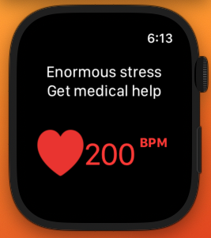
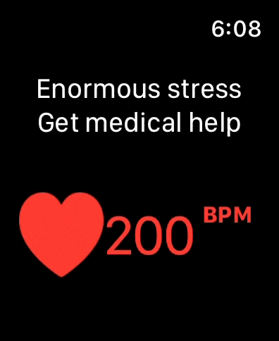
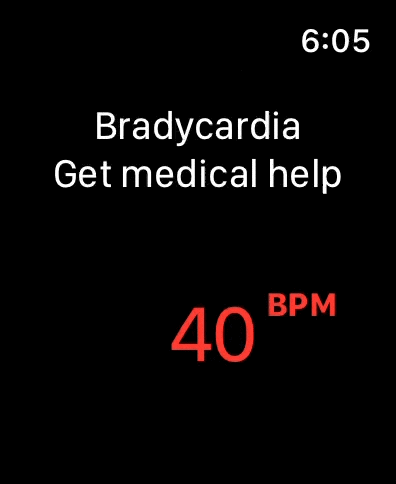
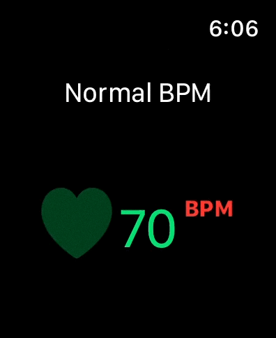
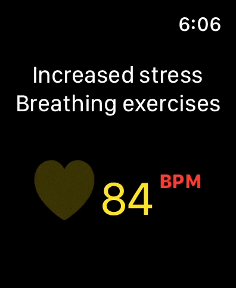
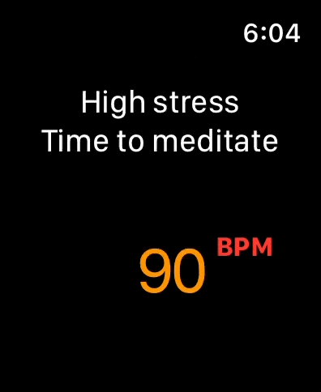

# MeditationWatch
The MeditationWatch app allows users to check their stress levels calculated from heart's beat per minute. All the data is calculated
from the HeatlhKit.
 
 
 

### Used Technologies:
1. SwiftUI
2. HealthKit
 

### Screenshots

#### Static watch screen

#### 200 BPM - Enormous stress

#### 40 BPM - Bradycardia

#### 70 BPM - Normal BPM

#### 84 BPM - Increased stress

#### 90 BPM - High stress

